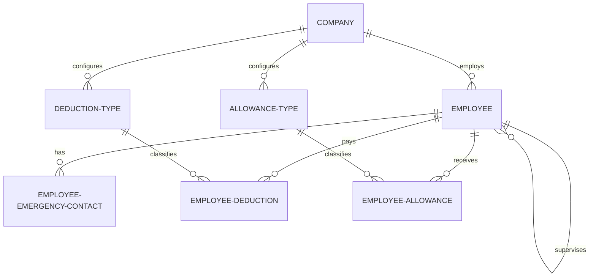

# Employee Record Schema Design

Design specification for adding employee management tables to the database schema. This implementation satisfies Third Normal Form (3NF) to support structured personal data, emergency contacts, company-level deduction and allowance catalogs, and employee-level enrollments.

---

## 1. Goal

The objective is to introduce tables for employee records to store rich personal data, statutory identifications, job roles, payroll parameters, emergency contacts, and customizable deductions/allowances in a highly normalized (3NF) relational structure using Drizzle ORM.

---

## 2. Proposed Database Schema

We will create a new folder under `packages/db/src/schema/employee/` containing:
1. `tables.ts`: Drizzle table definitions.
2. `relations.ts`: Drizzle relationship definitions.

### 2.1 Table Definitions (`tables.ts`)

#### **`employee`**
Stores core personal, contact, identification, job profile, and basic payroll info.
*   `id` (`text`): Primary Key.
*   `employeeNo` (`text`): Unique employee serial number/identifier.
*   `firstName` (`text`): Not null.
*   `middleName` (`text`): Nullable.
*   `lastName` (`text`): Not null.
*   `suffix` (`text`): Nullable.
*   `dateOfBirth` (`timestamp`): Nullable.
*   `gender` (`text`): Nullable.
*   `personalEmail` (`text`): Nullable.
*   `workEmail` (`text`): Nullable.
*   `phoneNumber` (`text`): Nullable.
*   `residentialAddress` (`text`): Nullable.
*   `tin` (`text`): Taxpayer Identification Number.
*   `philhealth` (`text`): PhilHealth number.
*   `pagIbig` (`text`): PAG-IBIG number.
*   `sssNo` (`text`): SSS number.
*   `philIdNo` (`text`): PhilID / National ID number.
*   `companyId` (`text`): Foreign Key -> `company.id` (on delete cascade).
*   `department` (`text`): Nullable.
*   `jobTitle` (`text`): Nullable.
*   `responsibilityCenter` (`text`): Nullable.
*   `employmentStatus` (`text`): Default: `"Active"`.
*   `employmentSchedule` (`text`): Nullable (e.g. `"Full-time"`, `"Part-time"`).
*   `supervisorId` (`text`): Self-referencing Foreign Key -> `employee.id` (on delete set null).
*   `dateOfHire` (`timestamp`): Nullable.
*   `payType` (`text`): Nullable (e.g. `"Salaried"`, `"Hourly"`).
*   `basePayRate` (`numeric(12, 2)`): Base pay rate.
*   `payFrequency` (`text`): Default: `"Semi-monthly"`.
*   `bankName` (`text`): Bank name.
*   `bankAccountNumber` (`text`): Bank account.
*   `brstnBankCode` (`text`): BRSTN / Bank Code.
*   `totalRegularHours` (`numeric(8, 2)`): Default: `"0.00"`.
*   `overtimeHours` (`numeric(8, 2)`): Default: `"0.00"`.
*   `leaveBalanceDays` (`numeric(5, 2)`): Default: `"0.00"`.
*   `taxBracketCode` (`text`): Nullable.
*   `createdAt` (`timestamp`): Default now.
*   `updatedAt` (`timestamp`): Default now.

#### **`employee_emergency_contact`**
Stores emergency contacts associated with each employee.
*   `id` (`text`): Primary Key.
*   `employeeId` (`text`): Foreign Key -> `employee.id` (on delete cascade).
*   `contactPerson` (`text`): Name of contact.
*   `contactNo` (`text`): Phone number.
*   `contactAddress` (`text`): Nullable.
*   `relationship` (`text`): e.g. "Spouse", "Parent".
*   `createdAt` / `updatedAt`

#### **`deduction_type`** (Master Table)
Stores deduction categories configured at the Company level.
*   `id` (`text`): Primary Key.
*   `companyId` (`text`): Foreign Key -> `company.id` (on delete cascade).
*   `name` (`text`): Deduction name (e.g. `"SSS Premium"`, `"PhilHealth"`, `"HMO"`, `"Salary Loan"`).
*   `category` (`text`): `"statutory"` or `"voluntary"`.
*   `createdAt` / `updatedAt`

#### **`employee_deduction`** (Enrollment Table)
Links an employee to a deduction type with a specific rate/amount.
*   `id` (`text`): Primary Key.
*   `employeeId` (`text`): Foreign Key -> `employee.id` (on delete cascade).
*   `deductionTypeId` (`text`): Foreign Key -> `deduction_type.id` (on delete cascade).
*   `amount` (`numeric(12, 2)`): Amount/rate to deduct.
*   `frequency` (`text`): Default: `"every_pay_period"`.
*   `createdAt` / `updatedAt`

#### **`allowance_type`** (Master Table)
Stores allowance categories configured at the Company level.
*   `id` (`text`): Primary Key.
*   `companyId` (`text`): Foreign Key -> `company.id` (on delete cascade).
*   `name` (`text`): Allowance name (e.g. `"Rice Subsidy"`, `"Internet Subsidy"`).
*   `isTaxable` (`boolean`): Default `false`.
*   `createdAt` / `updatedAt`

#### **`employee_allowance`** (Enrollment Table)
Links an employee to an allowance type with a specific amount.
*   `id` (`text`): Primary Key.
*   `employeeId` (`text`): Foreign Key -> `employee.id` (on delete cascade).
*   `allowanceTypeId` (`text`): Foreign Key -> `allowance_type.id` (on delete cascade).
*   `amount` (`numeric(12, 2)`): Amount to pay.
*   `frequency` (`text`): Default: `"monthly"`.
*   `createdAt` / `updatedAt`

---

## 3. Relationships & ER Diagram

We will define Drizzle relationships (`relations.ts`) to enable seamless relational querying.

---

## 4. Verification Plan

1.  **Drizzle Migration Generation**: Run `npx drizzle-kit generate` to verify Drizzle can successfully compile the schemas and generate correct SQL statements.
2.  **Drizzle Schema Compiling**: Import the tables and relations in `packages/db/src/schema/index.ts` and verify TypeScript compiles without errors.
